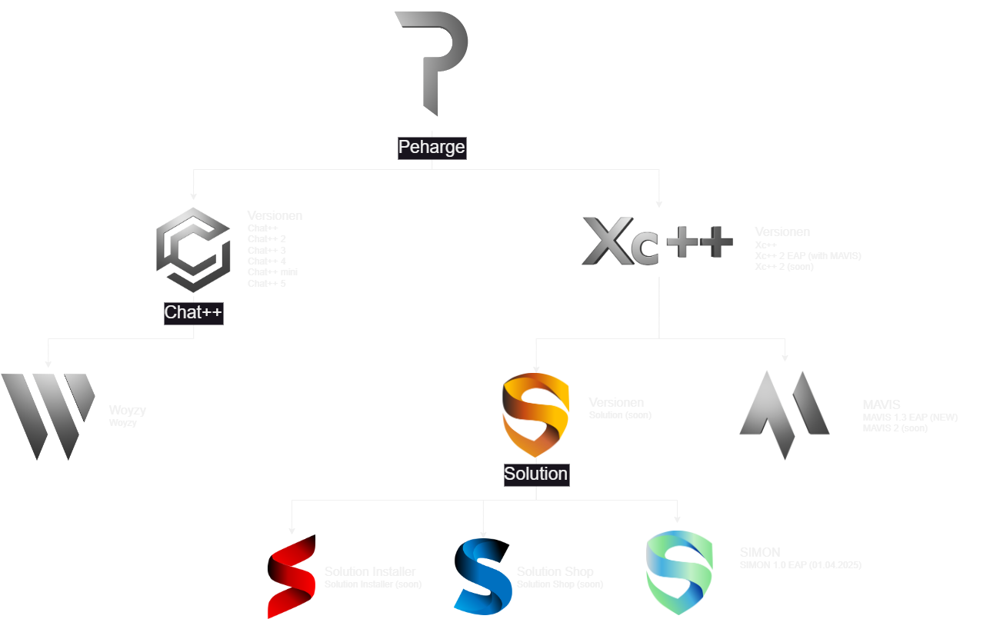

 

# **_Peharge_**

> <strong>The key to artificial intelligence has always been the representation.</strong>

I am 17 years old and work mainly on private projects. But since November 2024 I have decided to use this account more seriously - so it is worth giving me a subscription. The projects I publish here serve both my learning and the good of humanity.
My main project so far is [MAVIS](https://github.com/Peharge/MAVIS). 
In the future I will share more content that helps others and contributes to the transfer of knowledge. Stay tuned for upcoming projects! 
In addition, my project partner: [Ginkelmath](https://github.com/ginkelmath).  

  
  
   
  

  
More

  

## Repositories

  
More

    
    
    
    
  
  
  
  
  
  
  

## 🖥️ OS

  

## 👩‍💻 Programming Languages

### Main Languages:

  

### Languages I still want to learn:

  

### The compulsory obligations:

  

## 📚 Frameworks and Libraries

  

    
    
    
    
    
    

## 🛠️ Tools

  

  

## 🛠️ APPs

  

