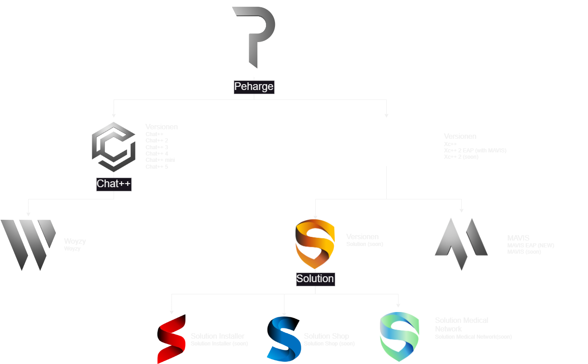

 

# **_Peharge_**

> <strong>The key to artificial intelligence has always been the representation.</strong>

I actually work privately, so I won't publish much on this account except for school projects. 
My only big public projects are [Woyzy](https://github.com/Peharge/Woyzy) and [MAVIS](https://github.com/Peharge/MAVIS). 
But since November 1, 2024, I’ve decided to take this account more seriously and will be publishing more content going forward!  

  
  
   
  

## 🖥️ OS

## 👩‍💻 Programming Languages

### Main Languages:

### Less Used Languages:

### The compulsory obligations:

## 📚 Frameworks and Libraries

## 🛠️ Tools

 

